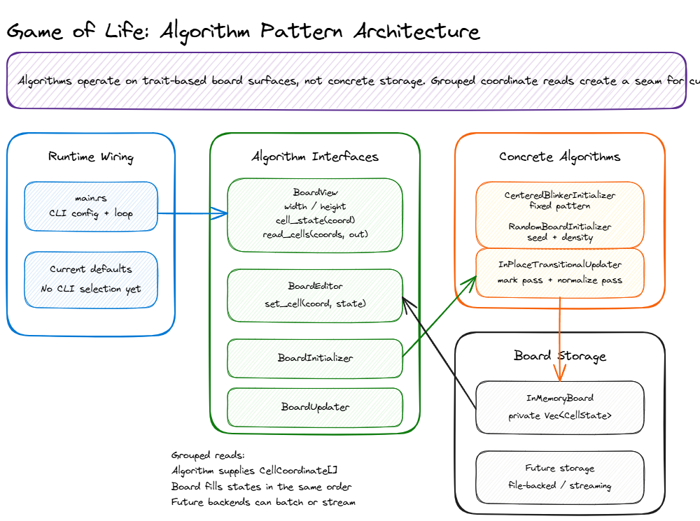

# Game of Life

An interview-style Conway's Game of Life project designed to start small and grow over time.

## Project goals

- Model the rules of Conway's Game of Life clearly.
- Keep the implementation easy to extend for future interview prompts.
- Add tests and refactor as the project gains features.

## Customer lens

This project is also framed as reproducible simulation software for research, education, and interview discussion. See [CUSTOMERS.md](CUSTOMERS.md) for the personas, customer jobs, and roadmap lens that should guide future feature work.

## Current scope

This repository is intentionally runtime-neutral for now. The first implementation can choose the language, test framework, and interface that best fit the next exercise.

## Rust Prototype Implementation

The Rust implementation uses a bounded board with trait-based initialization and update algorithms. The default update algorithm uses transitional cell states and a two-pass generation flow. See [docs/design.md](docs/design.md) for detailed design rationale and [docs/decision-rust.md](docs/decision-rust.md) for the language choice record.

### Build and Run (Windows)

```powershell
# Format and lint check
cargo fmt --check
cargo clippy --all-targets -- -D warnings

# Run tests
cargo test

# Build
cargo build --release

# Run console application
.\target\release\game-of-life.exe

# Run the smoke test the same way CI does (requires Git Bash on Windows)
bash ./scripts/smoke-test.sh

# Show CLI options
.\target\release\game-of-life.exe --help

# Run with a 10x10 board for 25 generations
.\target\release\game-of-life.exe --board-size 10x10 --max-iterations 25
```

### Build and Run (Linux / WSL)

```bash
# Format and lint check
cargo fmt --check
cargo clippy --all-targets -- -D warnings

# Run tests
cargo test

# Build
cargo build --release

# Run console application
./target/release/game-of-life

# Run the smoke test the same way CI does
./scripts/smoke-test.sh

# Show CLI options
./target/release/game-of-life --help

# Run with a 10x10 board for 25 generations
./target/release/game-of-life --board-size 10x10 --max-iterations 25
```

The console app prints concise run information and the final board state only. Per-generation board output is intentionally omitted for now to keep runs readable.

Runs stop early when they become extinct or when an attempted generation has no births and no deaths. The latter confirms the previous board was a fixed-point still-life state, reported as `stable`; the no-op confirmation itself is not counted in `iterations_run`. Repeating cycles such as blinkers still run to `--max-iterations` unless they become extinct. A fully dead board cannot come back alive under Conway's B3/S23 rule because births require exactly three live neighbors.

### Command-line options

#### Run options

| Option | Description | Default |
|--------|-------------|---------|
| `-h`, `--help` | Print usage and supported options. | N/A |
| `-b`, `--board-size <WIDTHxHEIGHT>` | Set the bounded 2D board size, such as `5x5` or `10x20`. | `10x10` |
| `-m`, `--max-iterations <COUNT>` | Set how many generations to run. Use `0` to print the initial board as the final state. | `10` |
| `--max-board-memory <SIZE>` | Set the in-memory board budget. Supports raw bytes plus `B`, `KB`, `MB`, and `GB` suffixes, such as `64MB`. | `64MB` |
| `--max-input-file-bytes <SIZE>` | Ceiling on the size of input files (snapshots, run records). | `256MB` |
| `--initial-board <SOURCE>` | Set the initial board source. Supported values are `demo`, `alive`, `blinker`, and `random`. | `demo` |
| `--load-board <PATH>` | Load the initial board from a `.gol` file (board snapshot or run record). Mutually exclusive with `--initial-board` and `--continue`. | N/A |
| `--load-from initial\|final` | When `--load-board` points at a run record, pick which embedded block to use. | `initial` |
| `--continue <PATH>` | Continue a prior run record: load its FINAL board as the initial board. Requires one of `--additional-iterations` or `--max-iterations` (see below). Mutually exclusive with `--load-board` and `--initial-board`. | N/A |
| `--additional-iterations <N>` | With `--continue`: run **N more** generations. Mutually exclusive with `--max-iterations`. | N/A |
| `-m`, `--max-iterations <COUNT>` with `--continue` | With `--continue`: target a **cumulative total** of `COUNT` iterations across the chain (continuation runs for `COUNT - source.iterations_run` more). Errors if `COUNT` is not strictly greater than the source run's `iterations_run`. Without `--continue`, just bounds this run's loop as usual. | `10` |

#### Save options

By default, every successful run auto-saves a record into `./runs/` with a filename of the form `<UTC-timestamp>-<short-run-id>.gol`. The save never overwrites an existing file.

| Option | Description | Default |
|--------|-------------|---------|
| `--runs-dir <DIR>` | Save run records into this directory; created if missing. | `./runs` |
| `--save-run <PATH>` | Save the run record to this explicit path (no auto-naming). Overrides `--runs-dir`. | N/A |
| `--no-save` | Suppress saving the run record entirely. | N/A |
| `--save-board <PATH>` | Save the final board as a standalone `.gol-snapshot` file. Works in both in-memory and streaming modes. In streaming mode this is the primary way to persist the final state (see below). | N/A |

#### Streaming (large boards)

When `--initial-board` (any of `demo`, `alive`, `blinker`, `random`) is asked
to run on a board larger than `--max-board-memory`, the run **auto-promotes**
to a file-streaming backend instead of failing. The simulation streams the
board through a binary scratch file on disk while respecting the memory cap.

```powershell
# 100x100 board (~10 KB) on a 1 KB cap: auto-promotes to streaming.
.\target\release\game-of-life.exe `
    --board-size 100x100 `
    --max-board-memory 1KB `
    --initial-board blinker `
    --max-iterations 5 `
    --no-save `
    --save-board final.gol-snapshot
```

| Option | Description | Default |
|--------|-------------|---------|
| `--working-dir <PATH>` | Directory for the streaming scratch file. Scratch files are auto-deleted on successful completion and **left on disk on any failure** for inspection. Only used when the run auto-promotes to streaming mode. | OS temp dir |

Streaming-mode limitations (deferred to follow-up PRs):

- Run-record save is not yet supported for streaming-sized boards. If `--save-run` / `--runs-dir` / the default auto-save is in effect, the run still completes successfully and a warning is printed; use `--save-board <PATH>` instead, or raise `--max-board-memory` to keep the board in memory.
- `--load-board` and `--continue` keep the existing in-memory path; loading a snapshot too large for the memory budget still fails with the same `requires N bytes` error as before.

See [docs/design.md](docs/design.md#streaming-board-for-very-large-boards) for the streaming algorithm and the on-disk scratch format.

#### Integrity

| Option | Description |
|--------|-------------|
| `--ignore-integrity` | Bypass the `content_hash` integrity check when reading a run record. Prints a `Warning:` on stderr and downgrades per-grid hash mismatches from errors to warnings. |

#### Verbs

In addition to a normal run, the binary exposes three standalone verbs:

| Verb | Description |
|------|-------------|
| `--replay <PATH>` | Re-execute a saved run record and diff its final board and key stats against the captured values. Exits 0 on match, non-zero on divergence with a structured diff on stderr. |
| `--extract-board <PATH> --output <SNAPSHOT-PATH>` | Extract one of the embedded board blocks (`INITIAL` or `FINAL`, selected via `--load-from`) from a run record and write it as a standalone, hash-free board snapshot. Use this to craft new starting boards from existing runs. |

### Examples

The repo ships with a small `examples/` directory of hand-curated `.gol` files:

- `examples/patterns/` — happy-path snapshots you can load directly (block, blinker, glider, R-pentomino). `--load-board examples/patterns/glider.gol --max-iterations 50` is a good first run.
- `examples/negative/` — **intentionally malformed files** that demonstrate the reader's error UX. Each one triggers a different error class (magic mismatch, truncated grid, bad cell character, count mismatch, unsupported encoding). See [`examples/README.md`](examples/README.md) for the full table.

### Persistence file format

Two file types share one parser pair (see [docs/design.md](docs/design.md) for the full spec):

- **Run record** (`GOL-RUN-RECORD v1`): auto-saved at the end of every run. Captures the configuration, run statistics, the initial board, and the final board. Protected by a `content_hash` trailer.
- **Board snapshot** (`GOL-BOARD-SNAPSHOT v1`): a standalone file containing just one board block plus a tiny header. Intentionally **hash-free** so users can hand-craft and hand-edit them. Use `--extract-board` to make one from a run record.

Sample workflow for crafting a new board from a prior run:

```powershell
# 1. Run something, get a run record saved to ./runs/.
.\target\release\game-of-life.exe --board-size 10x10 --max-iterations 50

# 2. Extract its FINAL board as a freely-editable snapshot.
.\target\release\game-of-life.exe `
    --extract-board runs\20260612T225520Z-7b3a1f0c.gol `
    --load-from final `
    --output edit-me.gol

# 3. Edit edit-me.gol in your text editor. No hash to update.

# 4. Use it as the initial board for a new run.
.\target\release\game-of-life.exe --load-board edit-me.gol --max-iterations 100
```

To reproduce a run from its record:

```powershell
.\target\release\game-of-life.exe --replay runs\20260612T225520Z-7b3a1f0c.gol
```

To continue a run for more generations (with full provenance recorded):

```powershell
.\target\release\game-of-life.exe `
To continue a run for more generations (with full provenance recorded):

```powershell
# Either form works:
.\target\release\game-of-life.exe `
    --continue runs\20260612T225520Z-7b3a1f0c.gol `
    --additional-iterations 100

# ...or in cumulative form (run until the chain has 200 total iterations):
.\target\release\game-of-life.exe `
    --continue runs\20260612T225520Z-7b3a1f0c.gol `
    --max-iterations 200
```
```

### Algorithm Overview

- **Board Implementation**: `InMemoryBoard` is the current finite, bounded board implementation (out-of-bounds neighbors are dead; no toroidal wrapping)
- **Board Access Traits**: Algorithms use fallible `BoardView`/`BoardEditor` traits instead of concrete board storage, including grouped coordinate reads for custom neighborhoods or future storage batching
- **Initialization Interface**: `BoardInitializer` is the trait for seeding a board; concrete implementations include demo, fully alive, blinker, and seedable random initializers
- **Update Interface**: `BoardUpdater` advances a board; the default is `InPlaceTransitionalUpdater`
- **Memory Budget**: `InMemoryBoard::try_new()` validates checked cell/byte math and rejects allocations above `--max-board-memory`
- **Cell States**: Dead, Alive, Dying, Resurrecting (transitional states enable single-board generation)
- **Default Generation Advancement**:
  1. **Mark Pass**: Compute each cell's next state using transitional states
  2. **Normalize Pass**: Convert Dying → Dead and Resurrecting → Alive
- **Neighbor Counting**: Alive and Dying treated as originally live; Dead and Resurrecting treated as originally dead
- **Result**: After generation, board contains only Dead and Alive states
- **Early Stop**: Extinction stops immediately. Fixed-point still lifes stop when an attempted generation reports zero births and zero deaths; that no-op confirmation is reported as stability at the previous generation. Oscillators/cycles are not classified as stable in this change.
- **Configuration**: CLI options select board size, iteration count, memory budget, and initial board source; `demo` remains deterministic while `random` generates a fresh random board each run

### Architecture diagram



Editable source: [docs/architecture.excalidraw](docs/architecture.excalidraw)

## Conway's Game of Life rules

For each generation:

- Any live cell with fewer than two live neighbors dies.
- Any live cell with two or three live neighbors lives.
- Any live cell with more than three live neighbors dies.
- Any dead cell with exactly three live neighbors becomes alive.

## Suggested next steps

1. Choose the initial language and test framework.
2. Add a small board representation.
3. Implement generation advancement.
4. Add tests for stable, oscillator, and edge-case patterns.

## Maintenance guidance

See [docs/product-code.md](docs/product-code.md) for product module conventions and [docs/testing.md](docs/testing.md) for test organization, `edge_case_` labels, and `negative_` labels.
For the persistence file format, integrity model, and CLI verbs, see the **Persistence** section in [docs/design.md](docs/design.md).

## Desktop visualizer (preview)

A Tauri v2 desktop app lives in [`desktop/`](desktop/) and wraps the existing
library with an interactive UI: pick a board size, click/drag to paint cells
in Setup mode, then watch the simulation evolve with Play / Pause / Step /
Restart / Jump-to-N controls and a live stats panel.

The app is its own independent Cargo workspace root so the core crate's
`Cargo.toml`, `Cargo.lock`, and CI workflow stay untouched.

See [`docs/desktop-app.md`](docs/desktop-app.md) for the architecture, IPC
surface, and state-machine details.

### Build the desktop app locally

```powershell
# Install the Tauri CLI once.
cargo install tauri-cli --version "^2.0" --locked

# Install frontend dependencies.
cd desktop\ui
npm ci
cd ..

# Run in dev mode (Vite + Tauri together). `--no-watch` skips Tauri's
# Rust-source watcher, which currently picks up unrelated changes inside
# `desktop/ui/node_modules/` and triggers spurious rebuilds. The Vite
# server still hot-reloads the frontend.
cargo tauri dev --no-watch

# Or produce a release bundle (NSIS .exe + .msi on Windows).
cargo tauri build
```

On Linux you'll need the Tauri v2 runtime packages first:

```bash
sudo apt-get install -y \
  libwebkit2gtk-4.1-dev libsoup-3.0-dev libayatana-appindicator3-dev \
  librsvg2-dev libssl-dev build-essential pkg-config
```

## Releases

Production binaries are produced by [`.github/workflows/release.yml`](.github/workflows/release.yml),
triggered by pushing a `v*` tag (e.g. `v0.2.0`). Each release attaches six
artifacts to a **draft** GitHub Release for human review before publication:

| Platform | CLI | Desktop installer | Desktop alternate |
|---|---|---|---|
| Windows x86_64 | `game-of-life-cli-<version>-windows-x86_64.exe` | `game-of-life-desktop-<version>-windows-x86_64.exe` (NSIS installer) | `game-of-life-desktop-<version>-windows-x86_64.msi` (MSI installer) |
| Linux x86_64 | `game-of-life-cli-<version>-linux-x86_64` | `game-of-life-desktop-<version>-linux-x86_64.AppImage` | `game-of-life-desktop-<version>-linux-x86_64.deb` |

Plus `release-notes-inputs.txt` (raw `git log` + `diff --stat`) for
auditability — the release notes themselves are drafted by GitHub Models
(`actions/ai-inference`, using the workflow's `GITHUB_TOKEN` with the
`models: read` scope; no PAT or Copilot seat is consumed). The prompt
template lives in [`.github/release-notes-prompt.md`](.github/release-notes-prompt.md)
so tone and structure are code-reviewable.

### Known issues with the unsigned Windows installers

The Windows `.exe` and `.msi` are **not code-signed** in v1. The first time
you run them, Windows SmartScreen will show **"Windows protected your PC"**.
Click **More info** → **Run anyway** to launch. Subsequent runs do not
re-prompt.

### AppImage glibc floor

The AppImage is built on `ubuntu-22.04` (glibc 2.35), so it runs on Ubuntu
22.04+, Debian 12+, Fedora 36+, and equivalent. Older distributions need to
build from source.

### `.gol` round-trip caveats

`.gol` files written by the desktop app round-trip through the CLI's
`--replay` and `--continue` for **completed** runs only. Mid-run "Save
board snapshot" files are board snapshots (no run statistics) and
manually-edited boards have a `manual` provenance that does not map onto a
CLI `--initial-board` source.
